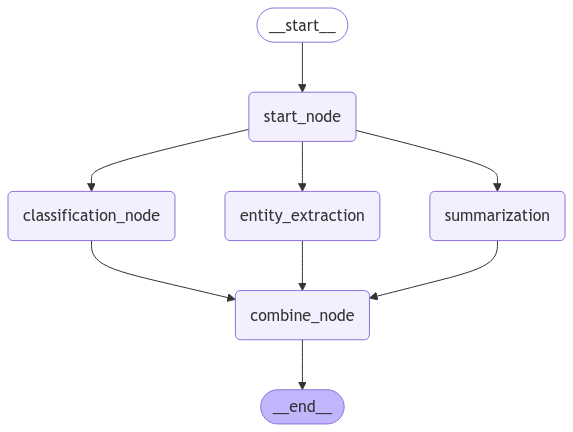

# Agents

This repo is built for testing new agentic features. It is built from langchain and langgraph 

---

## Project Structure

```
agent_resources/
    base_agent.py
    agent_factory.py
    agents/
        classification_agent/
            classification_agent.py
            nodes.py
            classification_agent_workflow.png
        task_planner_agent/
            task_planner_agent.py
            nodes.py
            task_planner_agent_workflow.png
        web_search_agent/
            web_search_agent.py
            nodes.py
            web_search_agent_workflow.png
    tools/
        tool_registry.py
        rag_tool.py
```

---

## Getting Started

### Prerequisites

- **Python 3.8 or higher**: Ensure you have Python installed. You can check your Python version with:

  ```bash
  python --version
  ```

- **Pip**: Python package installer should be available.

- **OpenAI API Key**: You need an API key from OpenAI. Sign up at [OpenAI](https://beta.openai.com/signup/).

- **Tavily API Key** (Optional): For web search capabilities, obtain a Tavily API key from [Tavily](https://tavily.com/).

### Installation

1. **Clone the Repository**

   ```bash
   git clone https://github.com/yourusername/llm-agents-project.git
   cd llm-agents-project
   ```

2. **Create a Virtual Environment (Optional but Recommended)**

   ```bash
   python -m venv venv
   source venv/bin/activate
   ```

3. **Install Dependencies**

   ```bash
   pip install -r requirements.txt
   ```

### Setup Environment Variables

1. **Copy the Template `.env` File**

   ```bash
   cp .env.template .env
   ```

2. **Populate the `.env` File**

   Open the `.env` file and replace the placeholders with your actual API keys:

   ```dotenv
   OPENAI_API_KEY=YOUR_OPENAI_API_KEY_HERE
   TAVILY_API_KEY=YOUR_TAVILY_API_KEY_HERE

   # OPTIONAL LANGSMITH FOR TRACING
   # LANGCHAIN_TRACING_V2=true
   # LANGCHAIN_ENDPOINT="https://api.smith.langchain.com"
   # LANGCHAIN_API_KEY="YOUR_API_KEY_HERE"
   # LANGCHAIN_PROJECT="PROJECT_NAME_HERE"
   ```

   - If you don't have a `TAVILY_API_KEY`, and don't plan to use the web search agent, you can leave it blank or remove it.
   - For langsmith, enter corresponding key and project name to enable traceability 

---

## Usage

### Running the Application

Run the `main.py` script to start interacting with the agents (mainly for testing purposes):

```bash
python main.py
```

### Selecting an Agent

Upon running the script, you'll be prompted to select an agent type:

```plaintext
Available Agent Types:
1. web_search_agent
2. classification_agent
3. task_planner_agent
Enter the number corresponding to the agent you want to visualize: 
```

Type the desired agent name and press Enter.

### Interacting with the Agent

After selecting an agent, you can start the conversation:

```plaintext
Welcome to the Chatbot! 
You've selected the web_search_agent agent. Type 'exit' to end the conversation.

You: 
```

- **Exit the Conversation**: Type `exit` and press Enter to terminate the session.

---


### **Overview of Directories**

- **`agent_resources/`**: Contains shared resources for agents, including the abstract base agent class (`base_agent.py`). This serves as the foundation for all agent implementations.
    - **`agents/`**: Houses individual agent implementations. Each agent is contained within its own folder, which includes:
        - **`<agent_name>.py`**: The main agent class file.
        - **`nodes.py`**: Definitions of node functions specific to the agent.
        - **`<agent_name>_workflow.png`**: A visual representation (DAG) of the agent's workflow.
    - **`tools/`**: Contains tool implementations and a registry for managing and retrieving tools. This includes:
        - **`tool_registry.py`**: A registry/factory class for registering and retrieving tools.
        - **`rag_tool.py`**: An example of a custom tool that can be integrated into agents.

---

## **Core Concepts**

### **LangGraph Overview**

**LangGraph** is a library that enables the creation of complex workflows using graphs. It offers advanced state management and dynamic graph capabilities, making it ideal for building sophisticated agent workflows.

#### **StateGraph**

- **StateGraph** manages the workflow as a **Directed Acyclic Graph (DAG)**.
- It allows for dynamic transitions and shared states between nodes.
- Supports optional reducers for aggregating state updates.

#### **Nodes**

- **Nodes** are functions that manipulate the state.
- Each node represents a unit of work within the graph.
- Nodes accept a `state` and return updated state information.
- They are the building blocks of the workflow.

#### **Edges**

- Edges define the flow between nodes in the graph.
- They determine the execution order and dependencies.
- **Fan-Out**: A node can have multiple outgoing edges, allowing for parallel execution of subsequent nodes.
- **Fan-In**: Multiple nodes can converge into a single node, combining their outputs.

#### **Parallel Execution**

- LangGraph supports concurrent execution of independent nodes.
- Nodes without dependencies can run in parallel, improving performance.
- State merging is handled automatically, but reducers can be defined for resolving conflicts.

### **Agent Architecture**

#### **Base Agent Class**

- Located in `agent_resources/base_agent.py`.
- Abstract base class `Agent` defines the structure and required methods.
- **Key Methods**:
    - `compile_graph()`: Abstract method to compile the agent's graph.
    - `run(message)`: Abstract method to execute the agent with a given message.
    - `visualize_workflow(save_path)`: Visualizes the agent's workflow DAG.
- **Purpose**: Provides a consistent interface for all agent implementations.

#### **LLM Integration**

- Agents utilize LangChain LLMs for processing natural language.
- LLM instances (e.g., `ChatOpenAI`) are passed to agents for use within nodes.
- Supports different models, including OpenAI GPT models and Hugging Face models.

#### **Memory Management**

- **Short-Term Memory**:
    - Managed as part of the agent's state.
    - Persisted using a checkpointer, enabling stateful conversations.
    - Allows agents to recall information within a single interaction thread.
- **Long-Term Memory**:
    - Shared across sessions and threads.
    - Useful for recalling information beyond a single interaction.
    - Implemented using memory stores provided by LangGraph.
- **MemorySaver**:
    - An instance used to manage memory persistence.
    - Ensures agents can resume conversations with the correct state.

#### **Compiled Graphs**

- Agents compile their workflows into **CompiledStateGraphs**.
- Compiled graphs provide a flexible stateful execution model.
- Different from traditional sequential execution, allowing for advanced state management.

### **Tools and ToolRegistry**

Tools extend the capabilities of agents, enabling them to perform actions like web searches or retrieval-augmented generation.
#### **Tools**

- Implemented as classes derived from `langchain.tools.BaseTool`.
- Each tool encapsulates specific functionality.
- Examples include web search tools or custom data retrieval mechanisms.

#### **ToolRegistry**

- Located in `agent_resources/tools/tool_registry.py`.
- Manages the registration and retrieval of tools.
- Provides methods to:
    - Register new tools.
    - Retrieve a single tool by name.
    - Retrieve multiple tools by a list of names.

**Usage Example**:

```python
from agent_resources.tools.tool_registry import ToolRegistry

# get the tavily_search tool from the list of tools within the ToolRegistry 
web_search_tool = ToolRegistry.get_tool('tavily_search', max_results=1)
```

#### **Integration with Agents**

- Agents can include tools as part of their workflows.
- Tools can be passed to prebuilt agents like `create_react_agent`.
- Custom agents can incorporate tools in their nodes or during graph compilation.

---
## **Building Agents**

In this section, we'll delve into the practical steps of creating agents using the LangGraph framework. We'll start by understanding the base agent class and then walk through the process of creating a new agent with custom nodes and workflows.

### **The `base_agent.py` Class**

The `base_agent.py` file defines the abstract base class `Agent`, which serves as a foundation for all agents in the project. It ensures a consistent interface and enforces the implementation of essential methods.

#### **Code Overview**

```python
from abc import ABC, abstractmethod
from langchain.schema import AIMessage
from IPython.display import display, Image
from langchain_core.runnables.graph import MermaidDrawMethod

class Agent(ABC):
    """
    Abstract base class for all agents.
    """

    def visualize_workflow(self, save_path: str = None):
        """
        Visualize the agent's workflow. Optionally save the visualization as an image.
        
        :param save_path: Optional path to save the image.
        """
        graph_image = self.agent.get_graph().draw_mermaid_png(
            draw_method=MermaidDrawMethod.API)
        image = Image(graph_image)

        # Display in the notebook (if in a Jupyter environment)
        display(image)

        # Save the image if a save_path is provided
        if save_path:
            with open(save_path, "wb") as f:
                f.write(graph_image)
            print(f"Workflow visualization saved at: {save_path}")

    @abstractmethod
    def compile_graph(self):
        """
        Abstract method for compiling the graph and creating an executable agent.
        """
        pass

    @abstractmethod
    def run(self, message) -> AIMessage:
        """
        Abstract method that all agents must implement.
        Takes a BaseMessage as input and returns an AIMessage as the response.
        """
        pass
```

#### **Key Components**

- **Abstract Methods**:
    - `compile_graph()`: Must be implemented to define and compile the agent's workflow graph.
    - `run(message)`: Must be implemented to define how the agent processes input messages.
- **Visualization Method**:
    - `visualize_workflow(save_path)`: Generates a visual representation of the agent's workflow using Mermaid diagrams. Optionally saves the image to a specified path.

#### **Purpose**

- Provides a template for all agents, ensuring they implement the necessary methods.
- Facilitates consistency across different agent implementations.
- Encourages the use of visualization for better understanding and debugging of workflows.

### **Creating a New Agent**

Creating a new agent involves subclassing the `Agent` base class, defining custom nodes, and compiling the workflow graph.

#### **Steps to Create an Agent**

1. **Subclass the Agent Base Class**

Begin by creating a new class that inherits from `Agent`.

```python
from agent_resources.base_agent import Agent

class MyAgent(Agent):
	def __init__(self, llm, memory):
		self.llm = llm
		self.memory = memory
		self.agent = self.compile_graph()

	def compile_graph(self):
		# Define and compile the graph here
		pass

	def run(self, message):
		# Implement the agent's execution logic here
		pass
```

2. **Define the State**

Create a `State` class using `TypedDict` to define the structure of the state that will be passed between nodes.

```python
from typing import TypedDict, List

class State(TypedDict):
	input_text: str
	result: str
	# Add other state variables as needed
```

3. **Create Nodes**

Define node functions that perform specific tasks. Each node accepts a `state` and returns updated state information.

```python
def my_node(state: State):
	# Perform some operation
	updated_result = state["input_text"].upper()  # Example operation
	return {"result": updated_result}
```

4. **Compile the Workflow Graph**

In the `compile_graph()` method, create a `StateGraph`, add nodes and edges, and compile it into an executable agent.

```python
from langgraph.graph import StateGraph, END

def compile_graph(self):
	workflow = StateGraph(State)

	# Add nodes to the graph
	workflow.add_node("start_node", lambda state: state)
	workflow.add_node("my_node", my_node)
	workflow.add_node("end_node", lambda state: state)

	# Set entry point
	workflow.set_entry_point("start_node")

	# Add edges to define the workflow
	workflow.add_edge("start_node", "my_node")
	workflow.add_edge("my_node", "end_node")
	workflow.add_edge("end_node", END)

	# Compile into an executable agent
	agent = workflow.compile()
	return agent
```

5. **Implement the Run Method**

Define how the agent processes input messages and returns responses.

```python
from langchain_core.messages import BaseMessage, AIMessage

def run(self, message: BaseMessage) -> AIMessage:
	try:
		state_input = {"input_text": message.content}
		result = self.agent.invoke(state_input)
		return AIMessage(content=result['result'])
	except Exception as e:
		# Handle exceptions
		return AIMessage(content="An error occurred while processing your request.")
```

6. **Visualize the Workflow (Optional)**

Use the `visualize_workflow` method to generate a diagram of the workflow.

```python
agent = MyAgent(llm, memory)
agent.visualize_workflow(save_path="my_agent_workflow.png")
```


#### **Best Practices**

- **Modularity**: Keep node functions focused on a single task for reusability.
- **State Management**: Clearly define the state variables and ensure consistency across nodes.
- **Error Handling**: Implement try-except blocks in the `run` method to manage exceptions gracefully.
- **Documentation**: Include docstrings and comments in your code for clarity.

---

## **Example Agent: ClassificationAgent**

The repo currently has a few example agents to reference. To illustrate the concepts discussed, let's explore the `ClassificationAgent` in detail. This agent processes input text by classifying it, extracting entities, and summarizing the content. These nodes are run concurrently 



### **Agent Overview**

- **Purpose**: Classify input text into predefined categories, extract entities, and generate a summary.
- **Workflow Structure**:
    - **Fan-Out**: The input text is sent to three concurrent nodes:
        - `classification_node`
        - `entity_extraction_node`
        - `summarization_node`
    - **Fan-In**: Outputs from the three nodes are merged in the `combine_node`.
    - **Output**: The classification result is returned to the user.

### **Code Walkthrough**

#### **`classification_agent.py`**

**Imports and Setup**:

```python
import logging
from langgraph.graph import StateGraph, END
from langchain_core.messages import BaseMessage, AIMessage

from agent_resources.base_agent import Agent
from .nodes import State, classification_node, entity_extraction_node, summarization_node

logger = logging.getLogger(__name__)
```

**Agent Class Definition**:

```python
class ClassificationAgent(Agent):

    def __init__(self, llm, memory):
        self.llm = llm
        self.memory = memory

        # Compile the graph
        self.agent = self.compile_graph()

    def compile_graph(self):
        workflow = StateGraph(State)

        # Add nodes to the graph
        workflow.add_node("start_node", lambda state: state)
        workflow.add_node("classification_node", classification_node)
        workflow.add_node("entity_extraction", entity_extraction_node)
        workflow.add_node("summarization", summarization_node)
        workflow.add_node("combine_node", lambda state: state)

        # Set entry point
        workflow.set_entry_point("start_node")

        # Add edges to create fan-out from start_node
        workflow.add_edge("start_node", "classification_node")
        workflow.add_edge("start_node", "entity_extraction")
        workflow.add_edge("start_node", "summarization")

        # Add edges to combine_node to create fan-in
        workflow.add_edge("classification_node", "combine_node")
        workflow.add_edge("entity_extraction", "combine_node")
        workflow.add_edge("summarization", "combine_node")

        # Add edge to END
        workflow.add_edge("combine_node", END)

        # Compile into an executable agent
        agent = workflow.compile()

        return agent

    def run(self, message: BaseMessage) -> AIMessage:
        try:
            state_input = {"text": message.content}
            result = self.agent.invoke(state_input)
            return AIMessage(content=result['classification'])
        except Exception as e:
            logger.error("Error generating response", exc_info=True)
            return AIMessage(content="Sorry, I encountered an error while processing your request.")
```

**Explanation**:

- **Initialization**:
    
    - Stores the LLM and memory instances.
    - Calls `compile_graph()` to build the workflow.
- **Graph Compilation**:
    
    - Creates a `StateGraph` with the defined `State` structure.
    - Adds nodes to the graph, including a `start_node` and a `combine_node`.
    - Sets up fan-out from the `start_node` to the processing nodes.
    - Sets up fan-in to the `combine_node` from the processing nodes.
    - Compiles the workflow into an executable agent.
- **Run Method**:
    
    - Prepares the initial state with the input text.
    - Invokes the agent with the state.
    - Returns the classification result as an `AIMessage`.

#### **`nodes.py`**

**Imports and Setup**:

```python
from typing import TypedDict, List
from langchain.prompts import PromptTemplate
from langchain_openai import ChatOpenAI
from langchain.schema import HumanMessage
from dotenv import load_dotenv
load_dotenv()
```

**State Definition**:

```python
class State(TypedDict):
    text: str
    classification: str
    entities: List[str]
    summary: str
```

**LLM Instance**:

```python
llm = ChatOpenAI(model="gpt-3.5-turbo", temperature=0)
```

**Node Functions**:

1. **Classification Node**:

```python
def classification_node(state: State):
	''' Classify the text into one of the categories: News, Blog, Research, or Other '''
	prompt = PromptTemplate(
		input_variables=["text"],
		template="Classify the following text into one of the categories: News, Blog, Research, or Other.\n\nText:{text}\n\nCategory:"
	)
	message = HumanMessage(content=prompt.format(text=state["text"]))
	classification = llm.invoke([message]).content.strip()
	return {"classification": classification}
```

2. **Entity Extraction Node**:

```python
def entity_extraction_node(state: State):
	''' Extract all the entities (Person, Organization, Location) from the text '''
	prompt = PromptTemplate(
		input_variables=["text"],
		template="Extract all the entities (Person, Organization, Location) from the following text. Provide the result as a comma-separated list.\n\nText:{text}\n\nEntities:"
	)
	message = HumanMessage(content=prompt.format(text=state["text"]))
	entities = llm.invoke([message]).content.strip().split(", ")
	return {"entities": entities}
```

3. **Summarization Node**:

```python
def summarization_node(state: State):
	''' Summarize the text in one short sentence '''
	prompt = PromptTemplate(
		input_variables=["text"],
		template="Summarize the following text in one short sentence.\n\nText:{text}\n\nSummary:"
	)
	message = HumanMessage(content=prompt.format(text=state["text"]))
	summary = llm.invoke([message]).content.strip()
	return {"summary": summary}
```


**Explanation**:

- Each node function:
    - Accepts the current `state`.
    - Constructs a prompt using `PromptTemplate`.
    - Invokes the LLM with the prompt.
    - Processes the response and updates the state with new information.
- **LLM Usage**:
    - A shared `llm` instance is used across all nodes for consistency.


---

## **Integrating Tools**

Tools enhance agents by providing additional capabilities, such as web searching or data retrieval. The `ToolRegistry` facilitates the management and integration of these tools.

### **ToolRegistry**

#### **Purpose**

- Centralizes the registration and retrieval of tools.
- Allows for modular addition and removal of tools.
- Simplifies the integration process within agents.

#### **Code Overview**

```python
from typing import Dict, Type, List
from langchain.tools import BaseTool

class ToolRegistry:
    """
    ToolRegistry manages the registration and retrieval of tools.
    """

    tool_registry: Dict[str, Type[BaseTool]] = {
        'tavily_search': TavilySearchResults,
        'rag_tool': RAGTool,
    }

    @classmethod
    def get_tool(cls, tool_name: str, **kwargs) -> BaseTool:
        """
        Retrieve a single tool by name.
        """
        tool_class = cls.tool_registry.get(tool_name)
        if tool_class is None:
            raise ValueError(f"Unknown tool: {tool_name}")
        return tool_class(**kwargs)

    @classmethod
    def get_tools(cls, tool_names: List[str], **kwargs) -> List[BaseTool]:
        """
        Retrieve multiple tools by their names.
        """
        return [cls.get_tool(name, **kwargs) for name in tool_names]
```

#### **8.1.3. Usage**

- **Registering a Tool**:

```python
ToolRegistry.tool_registry['my_custom_tool'] = MyCustomTool
```

- **Retrieving a Tool**:

```python
my_tool = ToolRegistry.get_tool('my_custom_tool', param1=value1)
```

- **Retrieving Multiple Tools**:

```python
tools = ToolRegistry.get_tools(['tool1', 'tool2'], shared_param=shared_value)
```


### **Example: WebSearchAgent**

The `WebSearchAgent` is another agent present in the examples, and it demonstrates how to integrate a tool using the `ToolRegistry`.

#### **Code Walkthrough**

**Agent Definition**:

```python
import logging
from langchain_core.messages import HumanMessage, AIMessage
from langgraph.prebuilt import create_react_agent
from agent_resources.tools.tool_registry import ToolRegistry
from agent_resources.base_agent import Agent

logger = logging.getLogger(__name__)

class WebSearchAgent(Agent):
    """
    LangGraph-based WebSearch agent implementation with MemorySaver for persistence.
    """

    def __init__(self, llm, memory):
        """
        Initialize the WebSearch agent using LangGraph.

        :param llm: The language model.
        :param memory: Persistent memory for managing conversation history.
        """

        # Retrieve the tavily_search tool from the registry
        web_search_tool = ToolRegistry.get_tool('tavily_search', max_results=1)

        self.tools = [web_search_tool]
        self.llm = llm
        self.memory = memory

        # Create a prebuilt React agent with tools and memory
        self.agent = self.compile_graph()
        
    def compile_graph(self):
        agent = create_react_agent(
            self.llm,
            tools=self.tools,
            checkpointer=self.memory,  
        )
        return agent

    def run(self, message: HumanMessage) -> AIMessage:
        """
        Process a HumanMessage and return an AIMessage response.

        :param message: User's input message.
        :return: AIMessage response.
        """
        try:
            thread_id = "default"  
            config = {"configurable": {"thread_id": thread_id}}

            response = self.agent.invoke(
                {"messages": [message]}, config=config)

            ai_message = response["messages"][-1]
            if isinstance(ai_message, AIMessage):
                return ai_message
            else:
                logger.error("Unexpected message type in response.")
                raise ValueError("Expected AIMessage in the response.")
            
        except Exception as e:
            logger.error("Error generating response", exc_info=True)
            return AIMessage(content="Sorry, I encountered an error while processing your request.")
```

#### **Explanation**

- **Tool Retrieval**:
    - Uses `ToolRegistry.get_tool()` to obtain the `tavily_search` tool.
- **Agent Compilation**:
    - Uses `create_react_agent()` to build an agent with the LLM, tools, and memory.
- **Run Method**:
    - Processes the user's message.
    - Invokes the agent and retrieves the AI's response.

### **Creating Custom Tools**

#### **Defining a Tool Class**

Create a new tool by subclassing `BaseTool`.

```python
from langchain.tools import BaseTool

class MyCustomTool(BaseTool):
    def __init__(self, param1, param2):
        super().__init__()
        # Initialize tool-specific parameters

    def _run(self, query: str):
        # Implement the tool's functionality
        result = perform_custom_operation(query)
        return result

    async def _arun(self, query: str):
        # Implement asynchronous functionality if needed
        result = await perform_custom_async_operation(query)
        return result
```

#### **Registering the Tool**

Add the new tool to the `ToolRegistry`.

```python
from agent_resources.tools.tool_registry import ToolRegistry

ToolRegistry.tool_registry['my_custom_tool'] = MyCustomTool
```

#### **Using the Tool in an Agent**

Retrieve and integrate the tool within your agent.

```python
my_tool = ToolRegistry.get_tool('my_custom_tool', param1=value1, param2=value2)
self.tools = [my_tool]
```